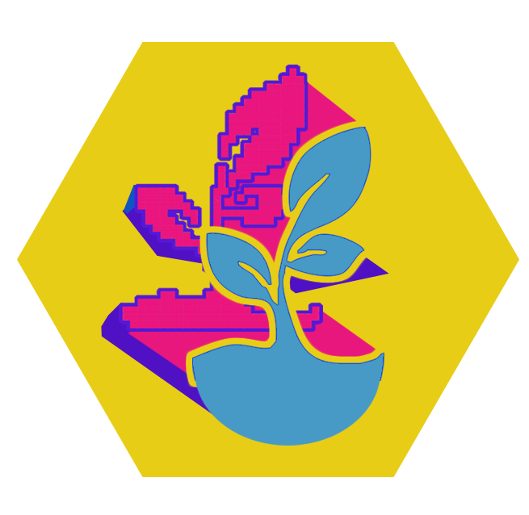
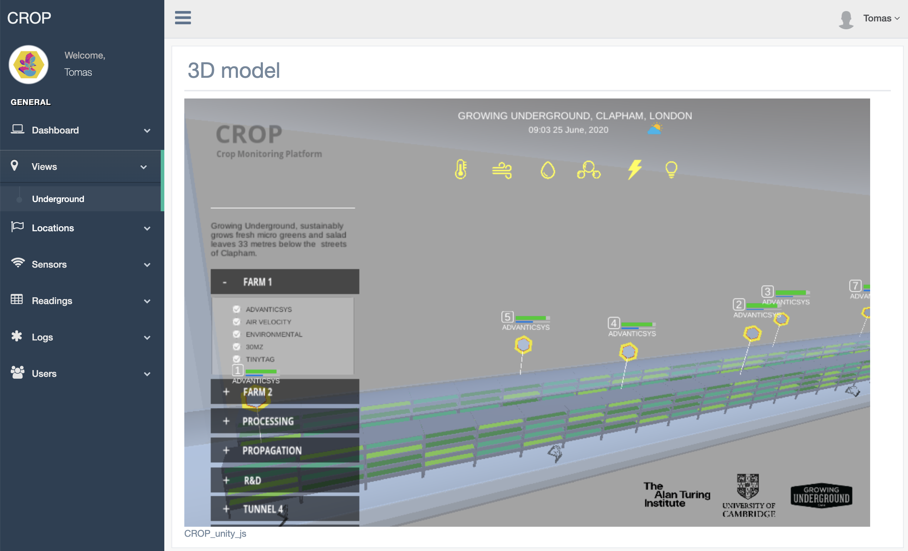
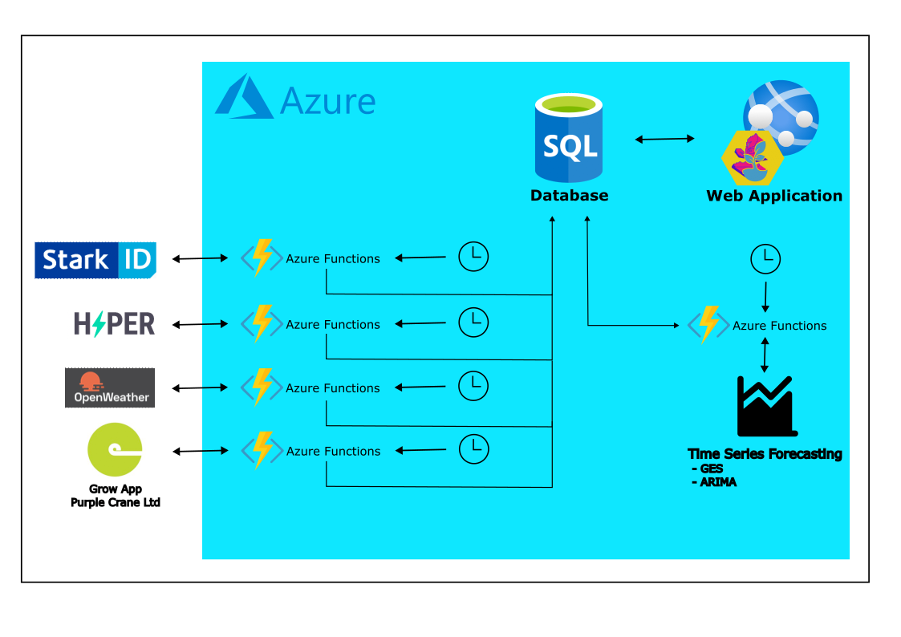
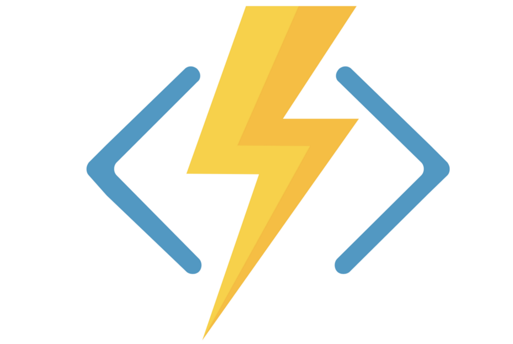
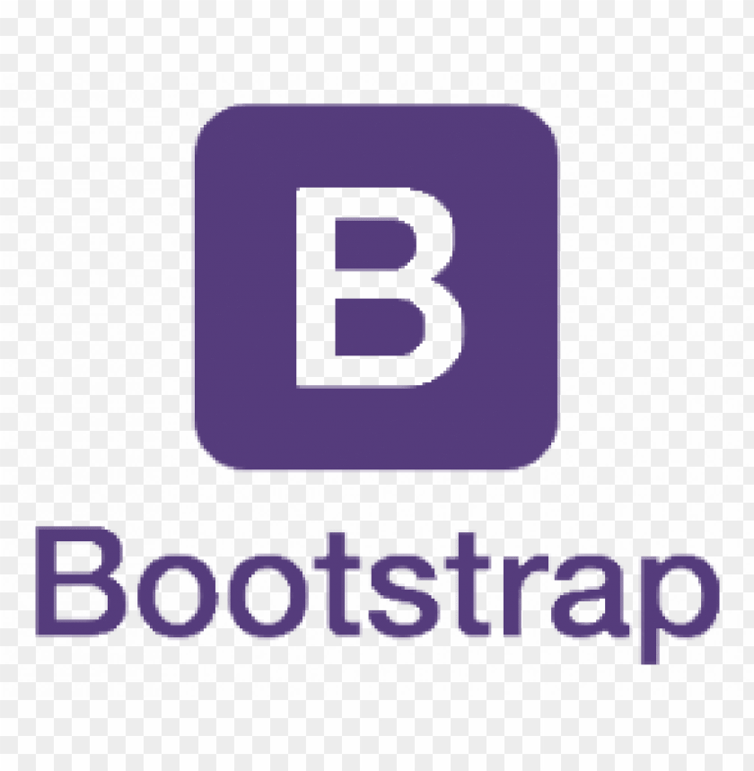

# CROP 

**C**rop is a **R**esearch **O**bservations **P**latform designed and created by [Dr Tomas Lazauskas](https://github.com/tomaslaz) and [Dr Flora Roumpani](https://github.com/entopia) in collaboration with [Dr Ruchi Choudhary's](https://www.turing.ac.uk/people/researchers/ruchi-choudhary) research group and [Growing Underground](http://growing-underground.com/).

## Summary

The overall aim of the CROP project is to prototype a digital twin of the Growing Underground's underground farm.

CROP is an on cloud-based application which utilizes the flexibility, customization and evolution that a cloud-native system provides, to better refine, simplify and improve the processes and architecture of the system with regards to our research needs.

The overall aim of the CROP project is to prototype a digital twin of the [Growing Underground](http://growing-underground.com/)'s underground farm which:
* collects heterogeneous IoT sensor data,
* provides 3D visualisation of the underground farm and sensor locations,
* helps to analyse farm conditions at various points in time.

 

  

## Key Functionalities

- **1** Users can access the CROP platform and database using multiple ways.
- **2** CROP web application is the main interface for the digital twin. Users can explore collected heterogeneous IoT sensor data, analyse farm conditions at various points in time, use the developed 3D visualisation tools.
- **3** CROP database is constantly updated from multiple streams of data: Zensie API, Stark energy usage platform, custom made (Raspberry Pi) sensors, and others.
- **4** CROP machine learning services integrate automated prediction and calibration models into the platform.

 

  

## Disclaimer

CROP is a **development** code and we recommend that you do not deploy this **prototype** application in a production setting. The implementation is only for demonstration purposes only and we make no warranties of any kind, express or implied, about the completeness, accuracy, reliability, suitability or availability with respect to the web app, backend infrastructure or the information.

## Implementation

CROP is implemented using a well established software stack (given below) and exploits four different services on the Azure cloud computing platform.

### Solution / Software stack

<table style="text-align:center">
  <thead>
    <tr>
      <th>Platform</th>
      <th>Service</th>
      <th>Software</th>
    </tr>
  </thead>
  <tbody>
    <tr>
        <td rowspan=4></td>
        <td>
          
           Function
        </td>
        <td rowspan=4 style='width: 200px'>
           
           
           
           
           
           
           
           
        </td>
    </tr>
    <tr>
        <td>
          
           WebApp
        </td>
    </tr>
    <tr>
        <td>
          
           Storage
        </td>
    </tr>
    <tr>
        <td>
          
           PostgreSQL
        </td>
    </tr>
  </tbody>
</table>

### Development credits

[Gentelella](https://github.com/afourmy/flask-gentelella) - a free to use (MIT license) Bootstrap admin template on which the webapp is built.

## Deployment

#### Continuous Deployment

We employ a continuous delivery toolchain with Docker on Travis CI which publishes Docker images automatically when PR is made to the *master* or *develop* branches.

#### Manual

Steps of how to set up and deploy CROP locally or on Azure are documented [here](https://github.com/alan-turing-institute/CROP/wiki/1.-Set-up-and-deploy-CROP-locally-or-on-Azure).

## Getting help

If you found a bug or need support, please submit an issue [here](https://github.com/alan-turing-institute/CROP/issues/new).

## How to contribute

We welcome contributions! If you are willing to propose new features or have bug fixes to contribute, please submit a pull request [here](https://github.com/alan-turing-institute/CROP/pulls).

  
  &nbsp;&nbsp;&nbsp;
  
  &nbsp;&nbsp;&nbsp;
  

