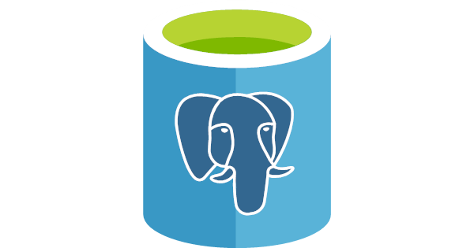

# CROP 

**C**ROP is a **R**esearch **O**bservations **P**latform designed and created by the [Research Engineering Group](https://www.turing.ac.uk/research/research-engineering) at the Alan Turing Institute in collaboration with [Dr Ruchi Choudhary's](https://www.turing.ac.uk/people/researchers/ruchi-choudhary) research group and [Growing Underground](http://growing-underground.com/).

## Summary

The aim of CROP is to prototype a digital twin of the [Growing Underground](http://growing-underground.com/) underground farm.

CROP is an on cloud-based application which utilizes the flexibility, customization and evolution that a cloud-native system provides, to better refine, simplify and improve the processes and architecture of the system with regards to our research needs.

The digital twin:
* collects heterogeneous IoT sensor data,
* provides 3D visualisation of the underground farm and sensor locations,
* helps to analyse and forecast farm conditions at various points in time.

 

  

## Key Functionalities

- The CROP web application is the main interface for the digital twin. Users can
    - explore collected heterogeneous IoT sensor data,
    - analyse farm conditions at various points in time,
    - use the interactive 3D visualisation of the farm,
    - forecast future farm conditions using machine learning models built into the platform.
- The CROP database is constantly updated from multiple streams of data: Hyper API, Stark energy usage platform, and others.
- For forecasting, CROP uses two models
    - An **A**uto**r**egressive **I**ntegrated **M**oving **A**verage (ARIMA) model uses past temperature and relative humidity data in the farm to forecast conditions a few days into the future.  The documentation for our Python implementation of this is available [here](models/arima_python/README.md).
    - A [**G**reenhouse **E**nergy **S**imulation](https://github.com/EECi/GES) (GES) model uses past sensor data, weather data and farm operational parameters (lighting schedules, fan settings, etc.) to forecast conditions a few days into the future using Gaussian Process Regression. The GES model has the ability to predict various alternative scenarios, such as how would conditions change if the lights were switched on at a different time, or the fan settings were changed.

The Unity 3D model is found in [this repo](http://github.com/alan-turing-institute/CROP_unity)
 

  

## Implementation

CROP is implemented using a well established software stack (given below) and exploits four different services on the Azure cloud computing platform.

### Software stack

<table style="text-align:center">
  <thead>
    <tr>
      <th>Platform</th>
      <th>Service</th>
      <th>Software</th>
    </tr>
  </thead>
  <tbody>
    <tr>
        <td rowspan=4></td>
        <td>
          
           Function
        </td>
        <td rowspan=4 style='width: 200px'>
           
           
           
           
           
           
           
           
        </td>
    </tr>
    <tr>
        <td>
          
           WebApp
        </td>
    </tr>
    <tr>
        <td>
          
           Storage
        </td>
    </tr>
    <tr>
        <td>
          
           PostgreSQL
        </td>
    </tr>
  </tbody>
</table>

### Repository structure
The directories are structured as follows:
* `core` has all the code for interacting with the database.
This includes defining the database schema in `structure.py`, some utilities, and modules for each of the ingress functions, for reading and writing the data from various sensors and other data sources.
* `tests` has the test suite for `core`.
* `webapp` has the Flask webapp.
* `ingress_functions` has the configurations and code for the Azure functions for importing data into the database.
The code itself for each function is nearly trivial:
It just calls the corresponding function in `core`.
This folder mainly exists to hold the `host.json` and `function.json` files for each function.
* `models` has the code for the forecasting models, ARIMA and GES.
* `media` has illustrations, logos, etc.
* `util_scripts` has various utilities that don't fit the other categories.
* `.secrets` has shell scripts for setting environment variables with secrets, such as database passwords, to facilitate running a local copy of the webapp for development use.
The version-controlled files are merely templates, to be filled in with the actual values for the secrets.

All of `tests`, `webapp`, `ingress_functions`, `util_scripts`, and `models` import and use various parts of `core`. None of them import from or talk to each other.

The repository root also has three Docker files:
* `Dockerfile_ingress_functions` builds a container that holds all the functions in `ingress_functions`, in an environment to run them on an Azure function app.
* `Dockerfile_models_functions` builds a similar container that holds the functions in `models`, for running the predictive models on an Azure function app.
* `Dockerfile_webapp` builds the webapp, ready to be deployed as an Azure app service. It builds on `webappbase`.
* `Dockerfile_webappbase` is a container that installs some of the dependencies needed by the webapp.
It's separated from `webapp` to improve build times, and shouldn't need to be rebuilt except in rare circumstances.

Some of the subfolders have their own READMEs. See them for more details of each part.

### Development credits

[Gentelella](https://github.com/afourmy/flask-gentelella) - a free to use (MIT license) Bootstrap admin template on which the webapp is built.

## Deployment

We employ a continuous delivery toolchain using Github Actions which deploys the latest version of CROP when a push or a PR is made to the `main` or `develop` branches.
The Github Actions
* Build a Docker container for the webapp, and push it to Docker Hub.
* Build a Docker container for the Azure function apps that collect data into the database (ingress functions), and push it to Docker Hub.
* Publish the Azure function app for running the forecasting models.
* Run the CROP test suite.

The Azure services for the webapp and the ingress functions listen to updates on Docker Hub, and deploy the latest container once it has been pushed to the Hub.

The `main` and `develop` branches are deployed to production and testing versions of the platform, respectively. The former is relatively stable, the latter may be broken in the course of development.

### Scripted deployment

A complete set of infrastructure for a CROP deployment on Microsoft Azure cloud can bet setup using Pulumi.  
For instructions on how to do this, see [here](infrastructure/README.md)

## Developer instructions/running locally

When developing the code for the CROP platform, it may be useful/necessary to run the webapp locally.  To do this:
* Clone this repo, and change directory to it.
* (Recommended) create and activate a new Python environment, using conda or venv, or your favourite virtual environment tool.
* Run `pip install .`.   This will install the contents of the `core/` directory (which contains database-related schema and code, and many of the queries) as a python package called `cropcore`.  It will also install all the dependencies listed in `requirements.txt`.
* You will need to set several environment variables, containing e.g. database credentials, and API keys.   These will be in a file called `.secrets/crop.sh`.  There is a template file called `.secrets/template_crop.sh` where you can fill in the info as you have it (then copy to `crop.sh`), or you can ask for a copy of this file from an existing developer.
* Once you have it, run `source .secrets/crop.sh`.
* Ensure that you have `npm` (node package manager) installed.  To install this on MacOS, you can do `brew install npm`.
* Change to the `webapp/` directory, and run the command `./run.sh`.   You should then be able to navigate to the webapp by pointing your browser to `http://localhost:5000`.

## Getting help

If you found a bug or need support, please submit an issue [here](https://github.com/alan-turing-institute/CROP/issues/new).

## How to contribute

We welcome contributions! If you are willing to propose new features or have bug fixes to contribute, please submit a pull request [here](https://github.com/alan-turing-institute/CROP/pulls) if you have permissions, or fork the repository, make your changes, and submit a pull request from your fork.

  
  &nbsp;&nbsp;&nbsp;
  
  &nbsp;&nbsp;&nbsp;
  

