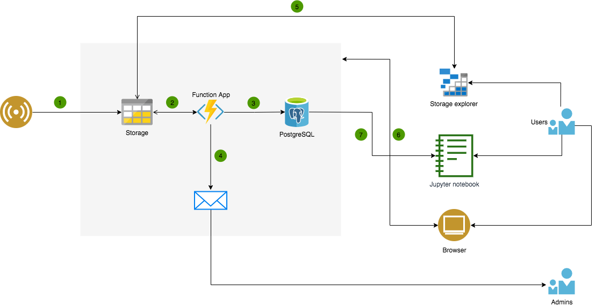

# Infrastructure

A schematic representation of the CROP infrastructure:

- **(1)** (*Outside action*) Sensor data is uploaded to the Azure storage account.

  We recommend that this should be done using the `utils/upload_sensor_data` script.

  It is possible to upload (access) the data in the storage account using other ways, such as `Storage explorer` (**(5)**). However, it is less secure, especially if the person is not familiar with the tools, and should be avoided.

- **(2)** (*Triggered*) Data ingress

  Once a new data file is uploaded to one of the blob storage containers with name ending with "rawdata" (e.g. advantixrawdata), it will be automatically processed by the system (via one of the Function Apps).

  The data ingress process first reads in the uploaded file and checks it for correctness, i.e. checks for missing values, makes sure that values are within specified limits, etc. If an error is identified during the checks, data ingress process is stopped and action **(4)** is triggered. If the data checks pass, action **(3)** is initiated.

  Once the data from the file has been processed, the uploaded file will automatically be moved from a `___rawdata` container to a `___processed` container, where `___` is the type of a sensor.

- **(3)** (*Triggered*) Upload to DB

  Depending on the data file (sensor type), sensor data will be uploaded to one of the DB tables designed to store readings from particular sensor type. During the upload, the process also checks the following:
  - all sensors in the uploaded file can be identified, i.e. exist in the DB,
  - there are no duplicate entries in the DB or in the file,

  If one of these conditions are not met, data upload process is stopped and action **(4)** is invoked.

- **(4)** (*Triggered*) Email notification (**Under development**)

  If an error occurs during the data ingress process, an automatic email will be generated and sent to specified email addresses.

  Note: free plan allows sending 25’000 emails per month.

- **(5)** (*User initiated*) Accessing storage account via Storage explorer.

  In order to share access to the storage account with other users, we recommend using [SAS](https://docs.microsoft.com/en-us/azure/storage/common/storage-sas-overview) (shared access signature).

  *You can provide a shared access signature to clients who should not be trusted with your storage account key but whom you wish to delegate access to certain storage account resources. By distributing a shared access signature URI to these clients, you grant them access to a resource for a specified period of time.* - Azure documentation.

  SAS key can be generated using the following process:

  Storage accounts -> (storage account name) -> Shared access signature -> Please choose carefully permissions and start/expiry dates you would like to grant for the access using the connection string and click Generate SAS and connection string.

  Once the connection string is generated and shared with a user, user can access it via Storage Explorer:

  1. Click on __Connect to Azure Storage__

  2. Choose __Use a connection string__ and click __Next__.

  3. Enter a preferred display name for the storage account, e.g. `CROP`.

  4. Enter the __connection string__

  5. click __Next__ and __Connect__.

  A storage account should be visible under the Storage Accounts in the navigation panel. The file system can be accessed in Storage Accounts in the explorer menu.

- **(6)** (*User initiated*) Accessing storage account (subscription) via [portal](portal.azure.com).

  Users added via IAM to the Azure subscription can use this way to access the storage. However, this access should only be available to the admins of the system.

- **(7)** (*User initiated*) Accessing storage account in other ways (such as Jupyter notebook).
