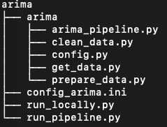

# Auto-Regressive Integrated Moving Average (ARIMA) model

**Note**: the *ARIMA model* here refers to the time-series model implemented in `DTBase`.

## Theoretical background

The *ARIMA model* is designed to produce a forecast of a univariate (i.e. single variable) time series, e.g. temperature.
It employs the [SARIMAX model of the statsmodels library](https://www.statsmodels.org/dev/generated/statsmodels.tsa.statespace.sarimax.SARIMAX.html).

In the current implementation, the following parameters can be specified for the *ARIMA model*.
See the [SARIMAX model documentation page](https://www.statsmodels.org/dev/generated/statsmodels.tsa.statespace.sarimax.SARIMAX.html) for more details.

 - `arima_order`: The (p, d, q) order of the model for the number of auto-regressive parameters, differences, and moving-average parameters, respectively.
 - `seasonal_order`: The (P, D, Q, s) order of the seasonal component of the model for the auto-regressive parameters, differences, moving-average parameters, and periodicity, respectively.
 - `trend`: The parameter controlling the trend polynomial of the time series.

Currently, support for exogenous regressors (i.e. the effect of external variables on the modelled variable) is **not provided**.
Therefore, the *ARIMA model* of `DTBase` can be employed to fit a model to a univariate time series that:
 - Shows a changing variable that regresses on its own prior (lagged) values, i.e. is **auto-regressive**. The model implicitly assumes that the future will resemble the past.
 - May be non-stationary. The **integrated** part of the model represents the differencing of raw observations to allow the time series to become stationary.
 - May contain outliers or random, short-term fluctuations, whose influence is smoothed out by employing constantly updated **moving averages**.
 - May have a **seasonal** component, where seasonality in a time series is defined as a regular pattern of changes that repeats itself (e.g. daily temperature fluctuations between day/night).
 - May have a **trend**, which represents the long-term change in the level of a time-series (e.g. upward monotonic due to a constantly increasing average temperature).

## Code Structure
The following figure shows relevant files in the *ARIMA model* directory:



User-specified parameters are controlled through `config_arima.ini`.
These include specification of what data to pull from the database, parameters for data pre-processing, as well as model parameters such as `arima_order`, `seasonal_order` and `trend`.
All user interaction with the model can be done through `config_arima.ini`.

The *ARIMA model* Python modules are:
 1. `arima.get_data`: employed to fetch data stored in the data base using `sqlalchemy`. Make sure you first source your `.secrets` file containing usernames, passwords, etc. in order to be able to connect to the data base.
 2. `arima.clean_data`: employed to clean up the data fetched from the data base before further processing.
 3. `arima.prepare_data`: used to pre-process the cleaned data before feeding it to the model.
 4. `arima.arima_pipeline`: this is the main module, which contains functions for model fitting and forecasting, as well as functions for model evaluation such as time-series cross-validation.

The script `run_locally.py` can be employed to run the *ARIMA model* locally in your machine.
Just run:
```bash
python run_locally.py
```
in your terminal.
